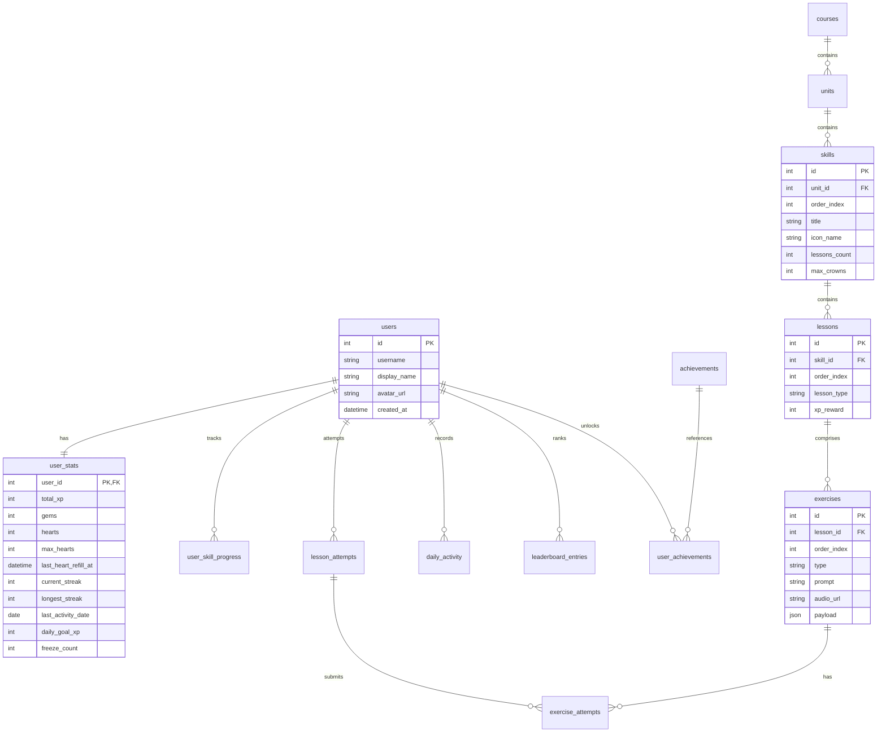

# Duolingo Clone — Full Stack Web Application

> 🚀 **Live Demo:** Access the website here: [https://duolingo-aaz8apnzl-rampofins-projects.vercel.app/learn](https://duolingo-aaz8apnzl-rampofins-projects.vercel.app/learn)

A production-quality clone of the modern Duolingo web application (2024–25 UI). Features a fully functional lesson loop with 5 distinct exercise types, progress serialization, automated heart refills via gems, daily activity heatmaps, a Ruby League leaderboard, and achievements gamification.

---

## 🛠️ TECH STACK

| Layer | Technology | Details |
|---|---|---|
| **Backend** | Python 3.11, FastAPI | High-performance API routing with dependency injection |
| **Database** | SQLite + SQLAlchemy 2.0 | Declarative typed models with Alembic auto-migrations |
| **Frontend** | Next.js 14 (App Router) | React server/client components, Tailwind CSS v4 styling |
| **State Management** | Zustand | Optimized client stores (for hearts, XP, and lesson decks) |
| **Server State** | TanStack Query v5 | Cache syncing, queries, and optimistic mutations |
| **Animations** | Framer Motion | Smooth springs, shaking errors, and shared element layouts |
| **Icons** | Lucide React + Custom SVGs | Core interface vector indicators |

---

## 🏗️ SYSTEM ARCHITECTURE

```
                      +-----------------------------+
                      |      Next.js Frontend       |
                      |       (localhost:3000)      |
                      +--------------+--------------+
                                     |
                                     | JSON HTTP / CORS
                                     v
                      +-----------------------------+
                      |        FastAPI Router       |
                      |       (localhost:8000)      |
                      +--------------+--------------+
                                     |
                                     | Service Interface
                                     v
                      +-----------------------------+
                      |      Gamification / Path    |
                      |        Service Layer        |
                      +--------------+--------------+
                                     |
                                     | SQLAlchemy ORM 2.0
                                     v
                      +-----------------------------+
                      |      SQLite Database        |
                      |       (duolingo.db)         |
                      +-----------------------------+
```

---

## 📊 DATABASE SCHEMA (ER DIAGRAM)



---

## 📡 API ROUTE ENDPOINTS (`/api/v1`)

| Method | Endpoint | Description | Mock Header Auth |
|---|---|---|---|
| **GET** | `/me` | Returns current user profile stats + today's goal XP. | `X-User-Id` (Defaults: 1) |
| **GET** | `/courses/{id}/path` | Returns course units/skills + crowns progress & locks. | Yes |
| **GET** | `/lessons/{id}` | Returns lesson questions; **strips correct answers**. | Yes |
| **POST** | `/lessons/{id}/start` | Begins lesson session, validates hearts & makes attempt ID. | Yes |
| **POST** | `/attempts/{aid}/answer` | Submits single answer, updates hearts & yields solution. | Yes |
| **POST** | `/attempts/{aid}/complete` | Marks lesson complete, awards rewards, streak updates. | Yes |
| **POST** | `/hearts/refill` | Spends 350 gems to restore full hearts count (5/5). | Yes |
| **GET** | `/hearts/status` | Computes lazy time regeneration (1 heart / 4 hours). | Yes |
| **GET** | `/leaderboard` | Pulls Ruby League rankings populated with competitors. | Yes |
| **GET** | `/profile/{uid}` | Profile stats, achievements progress, 6-month heatmap grid. | No |
| **POST** | `/debug/advance-day` | Simulates next day (decrements activity dates for streaks). | Yes |

---

## 📝 EXERCISE PAYLOAD STRUCTURES

The payload schemas stored inside `exercises.payload` vary per exercise type:

### 1. `MULTIPLE_CHOICE`
```json
{
  "options": [
    { "id": "hola", "text": "hola", "image_url": "/images/hola.png" },
    { "id": "gracias", "text": "gracias", "image_url": null }
  ],
  "correct_id": "hola"
}
```

### 2. `TRANSLATE`
```json
{
  "word_bank": ["come", "bebe", "pan", "el", "gracias", "niño"],
  "correct_sequence": ["el", "niño", "come", "pan"],
  "distractors": ["gracias", "bebe"]
}
```

### 3. `MATCH_PAIRS`
```json
{
  "pairs": [
    { "left": "hola", "right": "hello" },
    { "left": "gracias", "right": "thanks" }
  ]
}
```

### 4. `FILL_BLANK`
```json
{
  "sentence": "Yo ___ pan",
  "options": ["como", "bebo", "gracias"],
  "correct": "como"
}
```

### 5. `TYPE_ANSWER`
```json
{
  "source_text": "Hola, buenos días",
  "accepted_answers": ["hello good morning", "hi good morning"]
}
```

---

## 🚀 LOCAL SETUP

Ensure you have **Python 3.11** and **Node.js 18+** installed.

### 1. Backend Service
```bash
cd backend
python3 -m venv .venv
source .venv/bin/activate
pip install -r requirements.txt

# Run migrations and apply database schema
alembic upgrade head

# Seed database with course details & mock users
python -m app.seed

# Start the API server
uvicorn app.main:app --reload --port 8000
```

### 2. Frontend Application
```bash
cd frontend
npm install

# Build environment config
echo "NEXT_PUBLIC_API_URL=http://localhost:8000" > .env.local

# Run developer server
npm run dev
```
Open [http://localhost:3000](http://localhost:3000) in your browser.

---

## 🐳 DOCKER COMPOSE SETUP

To start both services in isolated containers simultaneously:
```bash
docker-compose up --build
```
Access the application at [http://localhost:3000](http://localhost:3000).
Docs at [http://localhost:8000/docs](http://localhost:8000/docs).
